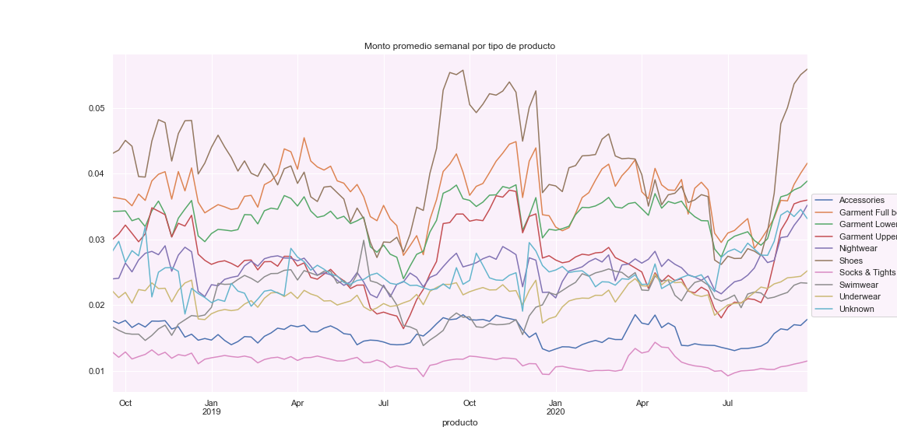

<!-- #output: -->
<!-- #  html_document: -->
<!-- #    df_print: paged -->
<!-- #  pdf_document: default -->

```{r setup, include=FALSE}
knitr::opts_chunk$set(echo = TRUE)
```


```{r, echo=FALSE, include=FALSE}
library(tidyverse)
library(data.table)
```
## Sistema de recomendación de moda. H & M

### Introducción

H&M Group es una familia de marcas y negocios con 53 mercados en línea y aproximadamente 4850 tiendas. Su tienda en línea ofrece a los compradores una amplia selección de productos para navegar. Pero con demasiadas opciones, es posible que los clientes no encuentren rápidamente lo que les interesa o lo que buscan y, en última instancia, es posible que no realicen una compra. Para mejorar la experiencia de compra, las recomendaciones de productos son clave. 

H&M Group ha decidido lanzar una competencia para desarrollar recomendaciones de productos basadas en datos de transacciones anteriores, así como en metadatos de clientes y productos. Los metadatos disponibles abarcan desde datos simples, como el tipo de prenda y la edad del cliente, hasta datos de texto de descripciones de productos y datos de imágenes de prendas.

Un sistema de recomendación también mejora la experiencia del cliente, pues es mejor que naveguen en la red viendo productos por gusto y no porque se vean obligados a hacerlo porque no encuentran lo que quieren comprar.


### Análisis exploratorio de datos (EDA)

Los datos proporcionados por la compañía son:

- Imágenes de los productos: Folder de imágenes que corresponde a todos los article_id
- Data set de clientes: Meta data de cada customer_id en el data set
  - Tamaño: 207.14 MB
  - Columnas: 7
  - Filas: 1,371,980
- Data set de transacciones: Data set que consiste en todas las compras hecha por cada customer_id
  - Tamaño: 3.49 GB
  - Columnas: 5
  - Filas: 31,788,324
- Data set de artículos: Meta data detallada para cada article_id disponible para compra
  - Tamaño: 36.13 MB
  - Columnas: 25
  - Filas: 105,542


**Descriptivos:**

- Número de clientes:  1,371,980
- Número de transacciones:  31,788,324
- Número de clientes que hicieron al menos una transacción:  1,362,281
- % de clientes que han hecho al menos una transacción:  99.29%
- Número de clientes que no han hecho ninguna compra:  9,699
- % de clientes que no han hecho ninguna compra:  0.71%
- Nùmero de productos: 105,542 

**Distribución de la edad de los clientes:**
Se observa que la mayoría de los clientes tienen edades entre 20 y 30. Sin embargo, también los hay de alrededor de 50 años.


```{r, out.width="0.5\\linewidth", include=TRUE, fig.align="center", fig.cap=c("Distribución de clientes por edad"),  echo=FALSE}

```


**Número de productos por categoria:**

La siguiente tabla muestra un resumen de los distintos tipos de producto y el número de items por cada uno de ellos:

| Categoria    | No. Items |
|--------------|-----------|
| Germent upper body         | 42741        |
| Germent lower body      | 19812         |
| Germent full body    | 13292     |
| Accessories       | 11158         |
| Underwear       | 5490         |
| Shoes       | 5283         |
| Swimwear       | 3127         |
| Socks & Tights       | 2442         |
| Nightwear       | 1899         |
| Cosmetic       | 49         |
| Bags       | 25         |
| Items       | 17         |
| Furniture       | 13         |
| Germent and shoe care       | 9         |
| Stationery       | 5         |
| Interior textile       | 3         |
| Fun       | 2         |
| Unknown       | 175         |


Los primeros productos de la tabla de arriba naturalemnte son los que concentran mayor ínidce de ventas prmedio semanales, tal y como lo muestra la figura 2. Lo anterior sugiere concentrarnos en un modelo para las categorías con mayor número de items, debido a la dinámica semanal que presentan y a partir de los cuales se puede logar el objetivo de la compañía de mejorar el número de ventas. 


```{r, out.width="0.7\\linewidth", include=TRUE, fig.align="center", fig.cap=c("Ventas promedio semanales"), echo=FALSE}

```

#### Data set para entrenamiento del modelo
**Esquema**
- Columnas:
  - customer_id: Id del cliente que viene desde el data set de transacciones
  - article_id: Id del articulo que viene desde el data set de artículos
  - purchase_count: Número de compras hechas por cada cliente
  - client_id: Id creado en la transformación del dataset para simplificar el mismo
- Filas: 27,306,439
- Tamaño: 297.6 MB


### Definición conceptual de retroalimentación implicita


En análisis exploratorio de los datos muestran que no tenemos una retroalimentación explicita de parte del usuario respecto de su compra. Generalmente existen dos tipos de sistemas de recomendación:

- **Sistemas de recomendación basados en contenido**. Busca crear perfiles para caracterizar la naturaleza de usuario o del producto[1]. Genera recomendaciones a partir de dicho perfil, por ejemplo a partir de gustos similares, es decir, si el usuario busco zapatos, la idea sería recomendarle zapatos, o si el usuario buscó películas de terror la idea sería recomendarle películas de terror. Estos sistemas son muy usados en la actualidad, por ejemplo en redes sociales como Facebook que usualmente presenta anuncios basados en la búsqueda de los usuarios. 

- **Sistemas de recomendación por filtrado colaborativo**. El enfoque en este sistema de recomendación es distinto, pues se basa en el comportamiento de los usuarios. Bajo este enfoque no es necesario crear un perfil. Filtrado colaborativo analiza las relaciones entre usuarios e interdependencias entre productos, para identificar nuevas asociaciones usuario-producto[1]. 

La información en este tipo de sistemas puede ser explicitica o implícita. La primera hace referencia a que se tiene una retroalimentación explícita del usuario acerca del producto, ej. ratings. La segunda hace referencia a que no se tiene un feeback explicito del usuario y la recomendación se basa más bien en el perfil de compara o uso del producto en si. **Para el enfoque de nuestro problema en particular se hará referencia al comportamiento de compras de x o y producto, es decir sin tener un feedback de manera explícita**.

Sea $r_{ui}$ los valores que asocian al usuario $u$ con el item $i$. En nuestro caso $r_{ui}$ representa el número de comparas que hizo el usuario $u$ del producto $i$. Definimos $p_{ui}$ como la variable que indica la preferencia del usuario $u$ por el item $i$ tal que:

$$
p_{ui} =
    \begin{cases}
        1, \qquad \text{ si } r_{ui} > 0\,\\
        0, \qquad \text{ si } r_{ui} = 0 \,
    \end{cases}
$$

Mientras mayor sea el valor de $r_{ui}$ mayor será nuestra creencia de que al usuario $u$ tiene preferencias por el artículo $i$, sin embargo, el hecho de que $p_{ui}$ sea 0 no significa que al usuario no le guste o no tenga preferencia por el item $i$ necesariamente. Esto se debe a que en realidad puede ser que la persona nuca haya visto el producto y por ello nunca lo ha comprado. Dicho lo anterior definimos:

$$c_{ui} = 1 + \alpha r_{ui}$$

como la medida de confidencia de la observación $p_{ui}$. Con ello tenemos una confianza mínima en $p_{ui}$ para cada usuario y producto. De forma que a medida que vemos más observaciones nuestra confidencia en $p_{ui}$ crece. El objetivo será encontrar un vector $x_u$ para cada usuario y un vector $y_i$ para cada producto tal que: 

$$p_{ui} = x^{T}_u y_i$$
Esta aproximación en factores latentes es la que se busca optimizar y deberá tomar en cuenta los distintos niveles de confianza $c_{ui}$ y además deberá considerar todos los posibles pares $u$, $i$ y no sólo los observados. Luego entonces, se busca que:

$$min \sum_{u,i} c_{ui}(p_{ui} - x^{T}_u y_i)^2 + \lambda(\sum_{u}||x_u||^2 + \sum_{i}||y_i||^2)$$

Donde el segundo término de la suma es necesario para regularizar el modelo tal que no exista sobreajuste. Finalmente, el método de optimización para este tipo de modelos es el de mínimos cuadrados alternados (ALS), por sus siglas en inglés. 


### Modelo propuesto

Con base en lo anterior nuestro problema se traduce de la siguiente manera:

- $u$ serán el _client_id_ dentro de la tabla de transacciones
- $i$ será la variable _article_id_ 
- $r_{ui}$ será el número de compras. En este caso la variable _purchase_count_ que se definió en la sección del EDA. 

La implementación manual de este algoritmo resulta ser poco factible pues se tendría que construir una matriz de preferencias del orden de 145 000 millones de entradas, producto de 1,371,980 usuarios y 105,534 items diferentes. Debido a la dificultad en el manejo de los datos y contando con en el hecho de que en spark existe una implementación para el modelo de recomendación implícita hemos decidido usar dicha herramienta.

El primer modelo considera el conjunto de datos completo de la tabla de transacciones. Se considera un set de entrenamiento del 80% de lo datos y el restante se utiliza para evaluar la precisión del modelo[2]. En el apéndice de este documento, en la sección modelo 1 se puede observar el código utilizado en spark para configurar este primer modelo. Los valores que se tomaron en cuenta son:

- **rank**: hace referencia el número de factores latentes derivados de la descomposición de la matriz $p_{ui}$.
- **maxIter**: dado que el método de optimización se hace a través de ALS, se define dentro de los parmétos del modelo el número máximo de iteraciones a considerar para obtener los valores que aproximen a la matriz $p$.
- **regParm**: hace referencia a $\lambda$ que es el parámetro de regularización dentro de la función de optimización. 
- **alpha**: hace referencia al valor $\alpha$ que nos ayuda a definir nuestro nivel de creencias dentro del modelo. 

La siguiente tabla muestra los posibles valores considerados para cada uno de los parámetros del modelo:

| Parameter    | Val 1     | Val 2      | Val 3      |Val 4       |
|--------------|-----------|------------|------------|------------|
| rank         | 10        | 20         | 30         | 40         |
| maxIter      | 5         | 10         | -          | -          |
| regParams    | 0.001     | 0.01       | 0.1        | -          |
| alphas       | 1         | 10         | 100        | -          |


Se considera cada combinación de valores de la tabla anterior, resultando en la iteración de 72 modelos. Como se verá en la sección de resultados, bajo este enfoque la propuesta resulta ser deficiente en resultados e incluso en el performance al momento de evaluar cada posible combinación. 

Lo anterior nos obliga a plantear una solución diferente al problema. Actualmente, en muchas de las tiendas de ropa en línea cuando una persona busca un producto, zapatos por ejemplo, se tiende a mostrar items del mismo tipo, es decir, se tiende sugerir una gama distinta de zapatos. Lo mismo pasa con muchos otros artículos, bajo ese contexto una segunda propuesta es calibrar un modelo por cada tipo de producto. 

Derivado de la tabla "articules" vista en la sección del EDA como se puede observar se tienen 18 tipos de productos, la idea es entonces generar un sistema de recomendación para cada uno de ellos. Para fines prácticos y por temas de recurso y tiempo, en este estudio sólo plantea considerar generar modelos para los siguientes tipos de artículos:


- Germent Lower body (GLB)
- Accesories
- Underwear
- Shoes

Los parámetros considerados para calibrar cada modelo son los mismos que se mencionan en la tabla 1, esto quiere decir que ahora por cada tipo de producto se probarán 72 modelos diferentes dando un total de 288 iteraciones diferentes.

### Evaluación del modelo y resultados

Cada modelo ajustado genera una predicción para los datos de prueba de la siguiente forma:

| client_id    | article_id| purchase_count | prediction |
|--------------|-----------|------------|------------|
| 1            | 673396002 | 2          | 1.3635218  |
| 1            | 484398001 | 6          | 1.3175579  |
| 1            | 759871002 | 1          | 0.9576558  |
| 2            | 372860001 | 1          | 0.2375944  |


El valor de la variable _prediction_ no busca aproximar la variable _purchase_count_ sino que en realidad es una medida de la preferencia del artículo en cuestión y es por ello que [1] sugiere considerar la siguiente métrica a la cual denominamos ROEM (Rank ordering error metric)[3]:

$$ROEM = \frac{\sum_{u,i} r_{ui}^t rank_{ui}}{\sum_{u,i} r_{ui}^t}$$

Donde $rank_{ui}$ será el percentil de la i-ésima predicción ordenada en forma descendente. Tomando como base la tabla anterior, el ejemplo del cálculo del rank en este caso sería:

| client_id    | article_id| purchase_count | prediction | rank   | r*rank     |
|--------------|-----------|------------|------------|------------|------------|
| 1            | 673396002 | 2          | 1.3635218  | 0          | 0          |
| 1            | 484398001 | 6          | 1.3175579  | 0.5        | 3          |
| 1            | 759871002 | 1          | 0.9576558  | 1          | 1          |
| 2            | 372860001 | 1          | 0.2375944  | 1          | 1          |


Note que para el caso del cliente 1 el valor del _rank_ más pequeño se le asigna a la predicción más grande mientras que el percentil más grande se lo asigna a la predicción más pequeña. Finalmente, el ROEM será el resultado de sumar la columna _r*rank_ dividido por la suma total de la columna _purchase_count_ que en este ejemplo de 40%. En esencia, lo que se esta haciendo es que para cada usuario estamos rankeando primero los items más importantes con base en la predicción, es por ello que mientras más cercano a cero se encuentre el ROEM mejor.

El cálculo del ROEM no esta implementado en spark, de modo que se hizo un calculo manual el cual tiene ciertas consideraciones:

- En el ejemplo anterior, cuando la combinación _client_id - articule_id_ es única, el percentil asignado es 1 (valor rank =1).
- Es muy probable que en el conjunto de datos de validación exista una combinación de client_id - articule_id que no aparece en el set de entrenamiento. Para esos casos, y para objeto de nuestro estudio, lo mejor será generar una propuesta de predicción aleatoria entre 0 y 1 para el valor de la predicción. 

En este último punto, es importante hacer énfasis en que esta no es la mejor solución, pero el enfoque para resolver el problema de recomendación para esos usuarios y productos probablemente ya no sería un algoritmo de retroalimentación implícita. La aleatoriedad considera en estos usuarios no sesga nuestro problema, de hecho en el peor de los casos nos diría que nuestro modelo no es bueno pues nos daría un ROEM cercano a 50% (si es que hay muchos valores nulos, por ejemplo). 

La siguiente tabla muestra el ROEM para algunas de las iteraciones realizadas bajo el modelo general y los modelos por producto. Cada iteración muestra la combinación rank-maxIter-regParam-alpha considerada:


| Iteración    | General   | Zapatos   | Underwear | Access    | GLB       |
|--------------|-----------|-----------|-----------|-----------|-----------|
| 10-5-0.001-10 |  49.14%   | 26.54%    | 34.60%    | 29.82%    | 39.63%    |
| 10-5-0.1-1   |  49.18%   | 26.96%    | 34.83%    | 29.89%    | 39.72%    |
| 10-5-0.1-100 |  49.37%   | 26.05%    | 34.60%    | 28.97%    | 39.75%    |
| 10-10-0.01-1 |  49.15%   | 26.90%    | 34.80%    | 29.86%    | 39.74%    |
| 10-10-0.1-100 |  49.20%   | 26.11%    | 34.39%    | 29.12%    | 39.68%    |
| 20-5-0.001-10 |  49.31%   | 26.02%    | 34.76%    | 29.27%    | 39.69%    |
| 20-5-0.1-1   |  49.20%   | 26.87%    | 34.80%    | 29.87%    | 39.70%    |
| 20-10-0.01-1 |  49.29%   | 26.84%    | 34.73%    | 29.79%    | 39.73%    |
| 30-5-0.001-10 |  49.29%   | 25.46%    | 34.03%    | 29.01%    | 39.70%    |
| 30-5-0.1-1   |  49.29%   | 26.75%    | 34.79%    | 29.84%    | 39.71%    |

**Access** = Accesories\
**GLB** = Germent Lower Body

Cabe mencionar que por cuestiones técnicas y de tiempo se opto por buscar el modelo con el mejor resultado en la métrica ROEM para los datos de validación y posteriormente se hizo validación cruzada con el objetivo de comprobar que realmente no se tuviera overfitting. Se consideraron 5 folds, la siguiente tabla muestra el resultado del ROEM calculado en cada uno así como el ROEM de los mejores modelos ajustados en cada caso:


| Modelo       | ROEM_f1   | ROEM_f2   | ROEM_f3   | ROEM_f4   | ROEM_f5   | ROEM_final|
|--------------|-----------|-----------|-----------|-----------|-----------|-----------|
| GLB          |  25.49%   | 26.34%    | 25.62%    | 26.30%    | 26.13%    | 20.14%    |
| Accesories   |  19.74%   | 20.13%    | 19.96%    | 20.18%    | 20.40%    | 22.14%    |
| Underwear    |  24.73%   | 24.47%    | 25.11%    | 24.59%    | 24.65%    | 17.96%    |
| Shoes        |  17.71%   | 17.39%    | 17.49%    | 17.45%    | 18.05%    | 18.10%    |


Finalmente, los parámetros en cada caso son:

| Modelo       | rank      | maxIter   | regParam  | alpha     |
|--------------|-----------|-----------|-----------|-----------|
| GLB          |  30       |  10       |  0.001    | 100       |
| Accesories   |  20       |  10       |  0.001    | 100       |
| Underwear    |  20       |  10       |  0.001    | 100       |
| Shoes        |  10       |  10       |  0.001    | 100       |


### Análisis de las recomendaciones (predicciones)

En la tabla 5 se observan los parámetros definidos para cada modelo por tipo de producto. Para cada uno de ellos se ha creado un modelo que nos permita generar predicciones de recomendación por tipo de producto. El nombre de los modelos que se han desarrollado son:

- als_shoes
- als_underwear
- als_accesories
- als_glb

Dentro de pyspark se ha desarrollado un método para generar recomendaciones de productos basada en la proyección de los factores latentes que se han obtenido para cada modelo. El orden en que se muestran los ratings proyectados es de forma descendente. Si bien, no es posible mostrar en detalle

**Imagen comparativo compro vs recomendacion para todos los modelos**
A continuación se muestran algunas recomendaciones que realiza el sistema basado en compras realizadas anteriormente por el cliente:

- **Modelo para zapatos**

<center>
{width=50%} 
</center>

- **Modelo para ropa interior (underwear)**

<center>
{width=50%}

</center>

- **Modelo para accesorios**

<center>
{width=50%}

</center>

- **Modelo para GLB**

<center>
{width=50%}

</center>


### Conclusiones

Finalmente, la estrategia de recomendación en general para el sistema de recomendación será tomar el top 5 de productos por cada tipo y sugerirlos al usuario. Incluso un top 3 resulta ser atractivo y a primera vista funcional. Sin embargo, si bien la métrica de calidad del modelo es mucho mejor que una recomendación al azar, medir el desempeño real del mismo se logrará hasta ver una implementación real del mismo, por ahora podemos decir que lo que estamos viendo en las sugerencias hace (en su mayoría) total sentido. 

Por otro lado, con una mejora en los recursos computacionales si duda este modelo se puede llevar a otro nivel pues es muy probable que exista una combinación de parámetros que permita hacer mejores recomendaciones. Para el caso de las predicciones con valores nulos, si bien el tratamiento para los fines de este trabajo es adecuado, para un modelo ya en producción se pueden sugerir otras alternativas que parecen ser más atractivas como el hecho de generar un sistema de recomendación basado en popularidad y luego generar una especie de modelo híbrido. 

Finalmente, si duda generar el modelo es muy importante, pero considerar la forma en como se resuelve el problema desde el punto de vista del código utilizado también lo es, esto porque spark procesa muy bien ciertas tareas pero existen otros métodos en los que se debe pensar muy bien la forma de implementarlos debido a que pueden tomar mucho tiempo, es decir se debe tratar de optimizar de alguna manera las operaciones que se realizan. Considerando poner el sistema en producción esta última parte sin duda es muy importante a tomar en cuenta.


\newpage
### Referencias

[1] Hu, Y., Y. Koren, and C. Volinsky. 2008. “Collaborative Filtering for Implicit Feedback Datasets.” In 2008 Eighth IEEE International Conference on Data Mining, 263–72.

[2] Felipe González 2022, "Métodos Análiticos", 2022, ITAM.

[3] DataCamp. "Building Recommendation Engines with PySpark" Course. <https://campus.datacamp.com/courses/recommendation-engines-in-pyspark/recommendations-are-everywhere?ex=1>

[4] Jannach, Dietmar & Lerche, Lukas & Zanker, Markus. (2018). "Recommending Based on Implicit Feedback". 10.1007/978-3-319-90092-6_14. 

[5] Sophie Watson, 2018. "Building an Implicit Recommendation Engine with Spark". Spark-AI SUMMIT EUROPE. 

[6] Apche Spark. "PySpark Documentation". <https://spark.apache.org/docs/latest/api/python/> 


### Apendice

**Código**

 [1] Notebook de transformación y exploración de datos <https://github.com/joelitam2021/metodos_analiticos_proyecto/blob/main/notebooks/EDA.ipynb>

 [2] Notebook de modelado <https://github.com/joelitam2021/metodos_analiticos_proyecto/blob/main/notebooks/Filtrado_colaborativo.ipynb>